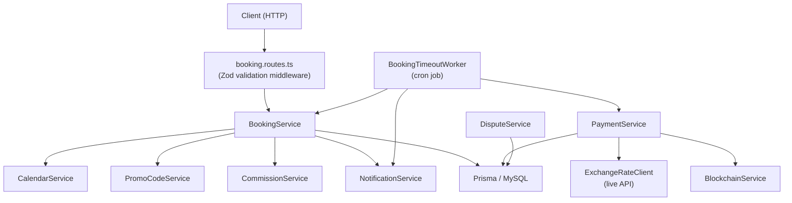
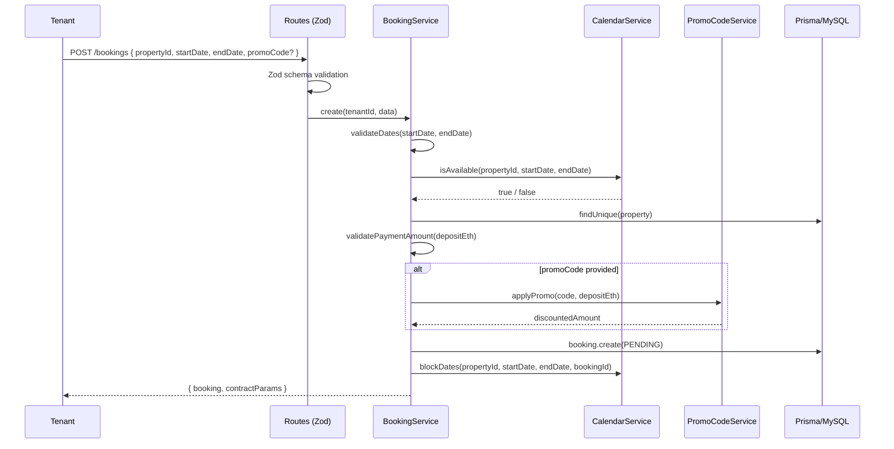
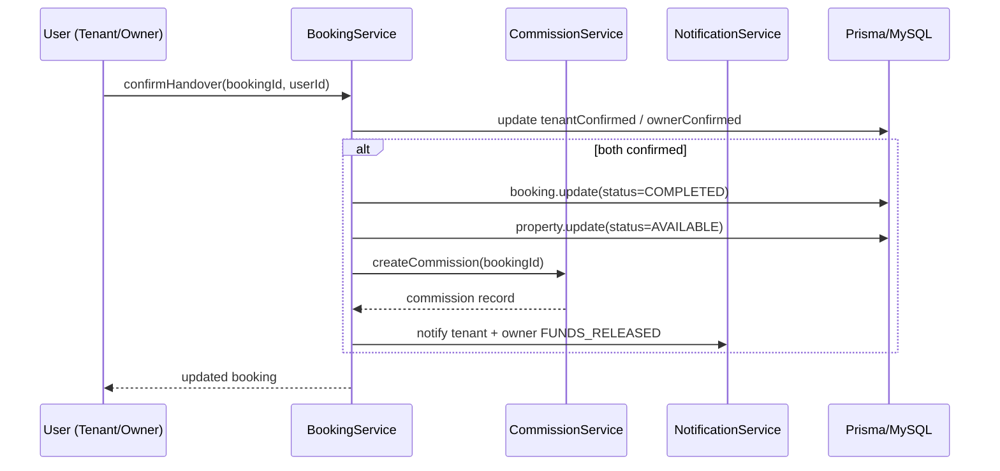
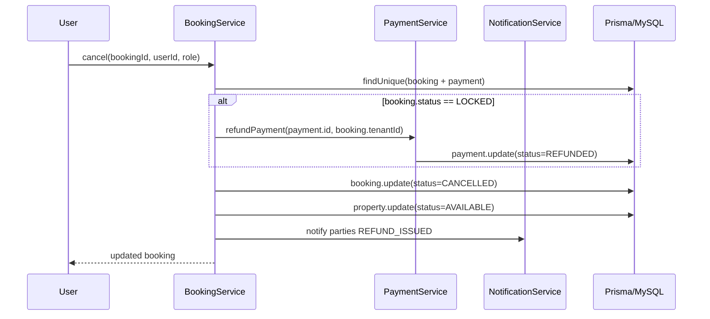
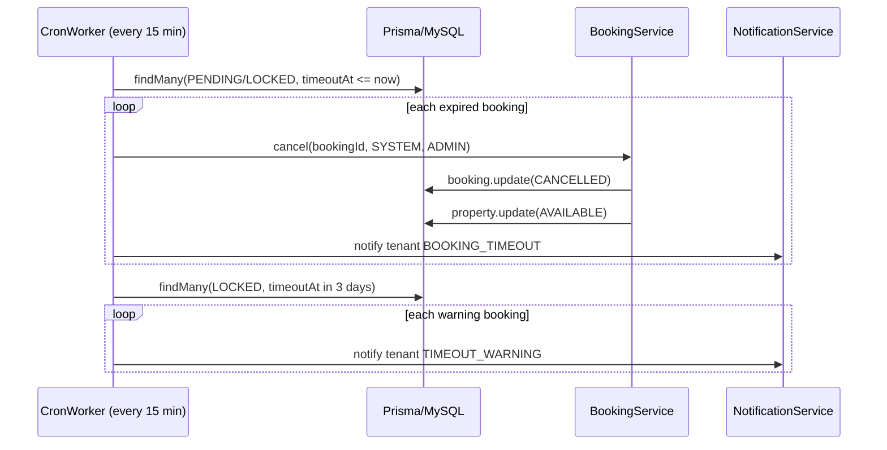

# Design Document: Booking System Improvements

## Overview

This document covers 15 targeted improvements to the escrow-based booking system of a Rwanda-focused property rental platform. The platform supports Ethereum, MoMo, and Card payments with a booking lifecycle of `PENDING → LOCKED → COMPLETED | CANCELLED | DISPUTED | REFUNDED`. The improvements address critical gaps in validation, automation, security, and integration without restructuring the existing architecture.

The changes span `BookingService`, `PaymentService`, `DisputeService`, `booking.routes.ts`, and introduce a new cron-based timeout worker and a dynamic exchange rate client.

---

## Architecture



---

## Sequence Diagrams

### Booking Creation with Promo Code and Calendar Check



### Booking Completion with Auto-Commission



### Cancellation with Refund



### Timeout Cron Worker



---

## Components and Interfaces

### BookingService (extended)

**Purpose**: Core booking lifecycle management with all 15 improvements applied.

**Interface additions**:
```typescript
interface BookingService {
  // Existing (modified)
  create(tenantId: number, data: CreateBookingInput): Promise<CreateBookingResult>
  getById(id: number, requestingUserId: number, requestingUserRole: string): Promise<Booking>
  cancel(id: number, userId: number, userRole: string): Promise<Booking>
  dispute(id: number, userId: number, reason: string): Promise<Booking>
  confirmHandover(id: number, userId: number): Promise<Booking>

  // New
  modifyDates(id: number, userId: number, data: ModifyDatesInput): Promise<Booking>
  cancelExpiredBookings(): Promise<{ cancelled: number }>
  sendTimeoutWarnings(): Promise<{ warned: number }>
}

interface CreateBookingInput {
  propertyId: number
  startDate: string   // ISO 8601
  endDate: string     // ISO 8601
  promoCode?: string
}

interface ModifyDatesInput {
  startDate: string
  endDate: string
}

interface CreateBookingResult {
  booking: Booking
  contractParams: {
    propertyId: number
    ownerAddress: string | null
    depositAmount: string        // after promo discount
    originalDepositAmount: string
    discountApplied: number      // 0 if no promo
    timeoutDuration: number
  }
}
```

**Responsibilities**:
- Date validation (past dates, ordering, minimum duration)
- Calendar availability check before creation
- Promo code application at creation
- Authorization check on `getById`
- Auto-commission trigger on completion
- Property status reset on completion/cancellation
- Refund trigger on LOCKED booking cancellation
- Accept `reason` in `dispute()`

---

### PaymentService (extended)

**Purpose**: Multi-currency payment processing with live exchange rates and escrow amount guard.

**Interface additions**:
```typescript
interface PaymentService {
  // Modified
  convertCurrency(amount: number, from: string, to: string): Promise<number>

  // New
  refundPayment(bookingId: number): Promise<RefundResult>
}

interface RefundResult {
  message: string
  refundedAmount: number
  currency: string
}
```

**Responsibilities**:
- Replace static `exchangeRates` map with `ExchangeRateClient.getRates()`
- Guard `/tx` endpoint: reject if `escrowAmount` is missing or `'0'`
- Trigger refund on LOCKED booking cancellation

---

### ExchangeRateClient (new)

**Purpose**: Fetch live ETH/USD and USD/RWF rates with in-memory cache (TTL: 5 minutes).

```typescript
interface ExchangeRateClient {
  getRates(): Promise<ExchangeRates>
}

interface ExchangeRates {
  ETH_USD: number
  USD_RWF: number
  fetchedAt: Date
}
```

**Responsibilities**:
- Primary source: CoinGecko `/simple/price?ids=ethereum&vs_currencies=usd`
- Secondary source: ExchangeRate-API for USD/RWF
- Cache rates for 5 minutes to avoid rate-limit hits
- Fall back to last known rates if API call fails (log warning)

---

### BookingTimeoutWorker (new)

**Purpose**: Cron job that auto-cancels expired bookings and sends 3-day warnings.

```typescript
interface BookingTimeoutWorker {
  start(): void   // registers cron schedules
  stop(): void
}
```

**Responsibilities**:
- Run every 15 minutes: cancel PENDING/LOCKED bookings where `timeoutAt <= now`
- Run daily at 09:00 Africa/Kigali: send `TIMEOUT_WARNING` notifications for bookings expiring within 72 hours
- Use `BookingService.cancel()` so property status and refund logic are applied consistently

---

### Zod Validation Schemas (new)

**Purpose**: Input validation on all booking routes.

```typescript
const createBookingSchema = z.object({
  propertyId: z.number().int().positive(),
  startDate: z.string().datetime(),
  endDate: z.string().datetime(),
  promoCode: z.string().optional(),
})

const txSchema = z.object({
  txHash: z.string().min(1),
  escrowAmount: z.string().refine(v => v !== '0' && parseFloat(v) > 0, {
    message: 'escrowAmount must be a positive non-zero value',
  }),
})

const modifyDatesSchema = z.object({
  startDate: z.string().datetime(),
  endDate: z.string().datetime(),
})

const disputeSchema = z.object({
  reason: z.string().min(20, 'Reason must be at least 20 characters'),
  againstUserId: z.number().int().positive(),
})
```

---

## Data Models

No new Prisma models are required. The following fields are added to existing models:

### Booking (additions)

```prisma
model Booking {
  // ... existing fields ...
  promoCodeId     Int?     @map("promo_code_id")   // FK to PromoCode
  discountApplied Float    @default(0) @map("discount_applied")  // ETH amount discounted
}
```

### NotificationType enum (additions)

```prisma
enum NotificationType {
  // ... existing values ...
  PAYMENT_FAILED
  TIMEOUT_WARNING
  DISPUTE_RESOLVED
}
```

### PromoCode (no changes needed — existing model is sufficient)

**Validation Rules**:
- `promoCode.isActive` must be `true`
- `now()` must be between `validFrom` and `validUntil`
- `usedCount < maxUses` (if `maxUses > 0`)
- Discount cannot reduce deposit below `0`

---

## Algorithmic Pseudocode

### 1. Date Validation

```pascal
PROCEDURE validateDates(startDate, endDate)
  INPUT: startDate: DateTime, endDate: DateTime
  OUTPUT: void (throws on invalid)

  now ← currentDateTime()

  IF startDate < now THEN
    THROW Error("Start date cannot be in the past")
  END IF

  IF endDate <= startDate THEN
    THROW Error("End date must be after start date")
  END IF

  durationDays ← daysBetween(startDate, endDate)
  IF durationDays < 1 THEN
    THROW Error("Minimum booking duration is 1 day")
  END IF
END PROCEDURE
```

**Preconditions**: Both dates are valid ISO 8601 strings parsed to DateTime.
**Postconditions**: No exception means dates are valid for booking.

---

### 2. Calendar Availability Check

```pascal
PROCEDURE checkAvailability(propertyId, startDate, endDate)
  INPUT: propertyId: Int, startDate: DateTime, endDate: DateTime
  OUTPUT: isAvailable: Boolean

  conflicts ← db.availability.findMany(
    WHERE propertyId = propertyId
      AND isBooked = true
      AND NOT (endDate <= startDate OR date >= endDate)
  )

  RETURN conflicts.length = 0
END PROCEDURE
```

**Preconditions**: `propertyId` exists; dates are validated.
**Postconditions**: Returns `false` if any booked availability record overlaps the requested range.
**Loop Invariants**: N/A (single DB query).

---

### 3. Timeout Enforcement (Cron)

```pascal
PROCEDURE cancelExpiredBookings()
  INPUT: none
  OUTPUT: { cancelled: Int }

  now ← currentDateTime()
  expired ← db.booking.findMany(
    WHERE status IN ['PENDING', 'LOCKED']
      AND timeoutAt <= now
  )

  count ← 0
  FOR each booking IN expired DO
    ASSERT booking.status IN ['PENDING', 'LOCKED']

    cancel(booking.id, SYSTEM_USER_ID, 'ADMIN')
    notify(booking.tenantId, 'BOOKING_TIMEOUT', ...)
    count ← count + 1
  END FOR

  RETURN { cancelled: count }
END PROCEDURE
```

**Preconditions**: Cron has exclusive lock (no concurrent runs).
**Postconditions**: All expired bookings are CANCELLED; properties are AVAILABLE.
**Loop Invariants**: Each iteration processes exactly one booking; `count` equals processed bookings.

---

### 4. Auto-Commission on Completion

```pascal
PROCEDURE confirmHandover(bookingId, userId)
  // ... existing confirmation logic ...

  IF tenantConfirmed AND ownerConfirmed THEN
    db.booking.update(status = 'COMPLETED')
    db.property.update(status = 'AVAILABLE')   // improvement #4

    TRY
      CommissionService.createCommission(bookingId)  // improvement #6
    CATCH err
      log.error("Commission creation failed", err)
      // Non-fatal: booking still completes
    END TRY

    notify(tenantId, 'FUNDS_RELEASED', ...)
    notify(ownerId, 'FUNDS_RELEASED', ...)
  END IF
END PROCEDURE
```

---

### 5. Cancellation Refund Logic

```pascal
PROCEDURE cancel(bookingId, userId, userRole)
  booking ← db.booking.findUnique(bookingId, include: [property, payment])

  IF booking.status = 'LOCKED' AND booking.payment EXISTS THEN
    PaymentService.refundPayment(bookingId)   // improvement #8
  END IF

  db.booking.update(status = 'CANCELLED')
  db.property.update(status = 'AVAILABLE')   // improvement #4

  notify(booking.tenantId, 'REFUND_ISSUED', ...)
  notify(booking.property.ownerId, 'BOOKING_CANCELLED', ...)
END PROCEDURE
```

---

### 6. Dynamic Exchange Rate Fetch

```pascal
PROCEDURE getRates()
  INPUT: none
  OUTPUT: ExchangeRates

  IF cache.rates EXISTS AND age(cache.rates) < 5 minutes THEN
    RETURN cache.rates
  END IF

  TRY
    ethUsd ← GET https://api.coingecko.com/api/v3/simple/price?ids=ethereum&vs_currencies=usd
    usdRwf ← GET https://v6.exchangerate-api.com/v6/{key}/pair/USD/RWF

    rates ← { ETH_USD: ethUsd.ethereum.usd, USD_RWF: usdRwf.conversion_rate, fetchedAt: now() }
    cache.rates ← rates
    RETURN rates
  CATCH err
    log.warn("Exchange rate fetch failed, using cached rates", err)
    IF cache.rates EXISTS THEN
      RETURN cache.rates
    ELSE
      RETURN FALLBACK_RATES  // hardcoded last-resort values
    END IF
  END TRY
END PROCEDURE
```

**Preconditions**: API keys are configured in environment variables.
**Postconditions**: Returns rates object; never throws (falls back gracefully).

---

### 7. Promo Code Application

```pascal
PROCEDURE applyPromoCode(code, depositEth)
  INPUT: code: String, depositEth: String (ETH amount)
  OUTPUT: { discountedAmount: String, discountApplied: Float, promoCodeId: Int }

  promo ← db.promoCode.findUnique(WHERE code = code)

  IF promo = null OR NOT promo.isActive THEN
    THROW Error("Invalid or inactive promo code")
  END IF

  now ← currentDateTime()
  IF now < promo.validFrom OR (promo.validUntil AND now > promo.validUntil) THEN
    THROW Error("Promo code has expired")
  END IF

  IF promo.maxUses > 0 AND promo.usedCount >= promo.maxUses THEN
    THROW Error("Promo code usage limit reached")
  END IF

  deposit ← parseFloat(depositEth)
  discount ← 0

  IF promo.discountPercent > 0 THEN
    discount ← deposit * (promo.discountPercent / 100)
  ELSE IF promo.discountAmount > 0 THEN
    discount ← promo.discountAmount  // in ETH
  END IF

  discounted ← MAX(deposit - discount, 0)

  db.promoCode.update(usedCount = usedCount + 1)

  RETURN { discountedAmount: discounted.toString(), discountApplied: discount, promoCodeId: promo.id }
END PROCEDURE
```

---

### 8. Authorization on getById

```pascal
PROCEDURE getById(bookingId, requestingUserId, requestingUserRole)
  booking ← db.booking.findUnique(bookingId, include: [property, tenant, transactions, review])

  IF booking = null THEN
    THROW Error("Booking not found")
  END IF

  isTenant ← booking.tenantId = requestingUserId
  isOwner  ← booking.property.ownerId = requestingUserId
  isAdmin  ← requestingUserRole = 'ADMIN'

  IF NOT (isTenant OR isOwner OR isAdmin) THEN
    THROW Error("Not authorized to view this booking")
  END IF

  RETURN booking
END PROCEDURE
```

---

### 9. Enhanced Dispute

```pascal
PROCEDURE dispute(bookingId, userId, reason, againstUserId)
  booking ← db.booking.findUnique(bookingId, include: [property])

  IF booking = null THEN THROW Error("Booking not found") END IF
  IF booking.status != 'LOCKED' THEN THROW Error("Can only dispute locked bookings") END IF

  isTenant ← booking.tenantId = userId
  isOwner  ← booking.property.ownerId = userId
  IF NOT (isTenant OR isOwner) THEN THROW Error("Not authorized") END IF

  IF length(reason) < 20 THEN
    THROW Error("Dispute reason must be at least 20 characters")
  END IF

  db.booking.update(status = 'DISPUTED')

  DisputeService.raiseDispute(userId, bookingId, againstUserId, reason)

  RETURN updated booking
END PROCEDURE
```

---

## Key Functions with Formal Specifications

### BookingService.create()

```typescript
static async create(
  tenantId: number,
  data: CreateBookingInput
): Promise<CreateBookingResult>
```

**Preconditions**:
- `tenantId` is a valid authenticated user ID with role `TENANT`
- `data.propertyId` references an existing, approved, AVAILABLE property
- `data.startDate` and `data.endDate` are valid ISO 8601 strings
- `data.startDate >= now()` and `data.endDate > data.startDate`
- Property owner is not the tenant

**Postconditions**:
- A `Booking` record exists with `status = 'PENDING'`
- `Availability` record is created and marked `isBooked = true`
- If `promoCode` provided: `booking.discountApplied > 0` and `promoCode.usedCount` incremented
- Owner receives `BOOKING_CREATED` notification
- Returns `contractParams.depositAmount` reflecting any discount

---

### BookingService.modifyDates()

```typescript
static async modifyDates(
  id: number,
  userId: number,
  data: ModifyDatesInput
): Promise<Booking>
```

**Preconditions**:
- Booking exists with `status = 'PENDING'`
- `userId` is the tenant of the booking
- New dates pass `validateDates()` checks
- New date range is available on the calendar (excluding current booking's own availability record)

**Postconditions**:
- `booking.startDate` and `booking.endDate` are updated
- `Availability` record is updated to reflect new dates
- Owner receives notification of date change

---

### PaymentService.convertCurrency()

```typescript
static async convertCurrency(
  amount: number,
  from: string,
  to: string
): Promise<number>
```

**Preconditions**:
- `amount >= 0`
- `from` and `to` are one of: `'ETH'`, `'USD'`, `'RWF'`

**Postconditions**:
- Returns converted amount using live rates from `ExchangeRateClient`
- If `from === to`, returns `amount` unchanged
- Never throws; falls back to cached/hardcoded rates on API failure

---

### ExchangeRateClient.getRates()

```typescript
static async getRates(): Promise<ExchangeRates>
```

**Preconditions**: Environment variables `COINGECKO_API_KEY` and `EXCHANGE_RATE_API_KEY` are set (optional — public endpoints used as fallback).

**Postconditions**:
- Returns `{ ETH_USD, USD_RWF, fetchedAt }` with values > 0
- Cache is populated for subsequent calls within 5-minute TTL
- Never throws

---

## Error Handling

### Scenario 1: Calendar Conflict

**Condition**: Requested dates overlap an existing `isBooked = true` availability record.
**Response**: `400 Bad Request` — `"Property is not available for the selected dates"`
**Recovery**: Client prompts user to select different dates.

### Scenario 2: Expired Promo Code

**Condition**: `promoCode.validUntil < now()` or `usedCount >= maxUses`.
**Response**: `400 Bad Request` — `"Promo code has expired"` / `"Promo code usage limit reached"`
**Recovery**: Booking proceeds without discount if client retries without promo code.

### Scenario 3: Missing/Zero escrowAmount on /tx

**Condition**: `escrowAmount` is absent or `'0'` in PATCH `/:id/tx` body.
**Response**: `400 Bad Request` — `"escrowAmount must be a positive non-zero value"`
**Recovery**: Client must re-submit with correct on-chain amount.

### Scenario 4: Exchange Rate API Failure

**Condition**: Both CoinGecko and ExchangeRate-API are unreachable.
**Response**: Warning logged; last cached rates used. If no cache exists, hardcoded fallback rates used.
**Recovery**: Automatic — next successful API call repopulates cache.

### Scenario 5: Commission Creation Failure on Completion

**Condition**: `CommissionService.createCommission()` throws (e.g., duplicate).
**Response**: Error is caught and logged; booking status remains `COMPLETED`.
**Recovery**: Admin can manually trigger commission creation via existing admin endpoint.

### Scenario 6: Unauthorized getById

**Condition**: Requesting user is not the tenant, owner, or admin.
**Response**: `403 Forbidden` — `"Not authorized to view this booking"`
**Recovery**: N/A — intentional access control.

### Scenario 7: Dispute Reason Too Short

**Condition**: `reason.length < 20`.
**Response**: `400 Bad Request` — `"Dispute reason must be at least 20 characters"`
**Recovery**: Client prompts user to provide more detail.

---

## Correctness Properties

*A property is a characteristic or behavior that should hold true across all valid executions of a system — essentially, a formal statement about what the system should do. Properties serve as the bridge between human-readable specifications and machine-verifiable correctness guarantees.*

### Property 1: Invalid date pairs are always rejected

*For any* pair of dates where `endDate <= startDate` or `startDate < now()`, `BookingService.validateDates()` shall always throw an error and never allow booking creation to proceed.

**Validates: Requirements 1.1, 1.2, 1.3**

---

### Property 2: Valid date pairs are always accepted

*For any* pair of dates where `startDate >= now()` and `endDate >= startDate + 1 day`, `BookingService.validateDates()` shall never throw a date-related error.

**Validates: Requirements 1.4**

---

### Property 3: Overlapping availability always blocks booking

*For any* property with an existing `isBooked = true` availability record, attempting to create a booking with any date range that overlaps that record shall always be rejected with a calendar conflict error.

**Validates: Requirements 2.2**

---

### Property 4: Successful booking creation always produces an availability record

*For any* successful booking creation, a corresponding `Availability` record with `isBooked = true` shall exist in the database linked to that booking.

**Validates: Requirements 2.3**

---

### Property 5: Expired bookings are always cancelled by the worker

*For any* set of bookings with status `PENDING` or `LOCKED` and `timeoutAt <= now()`, after `BookingTimeoutWorker.cancelExpiredBookings()` runs, all such bookings shall have status `CANCELLED`.

**Validates: Requirements 3.3**

---

### Property 6: Expired booking cancellation always triggers BOOKING_TIMEOUT notification

*For any* booking cancelled by the timeout worker, a `BOOKING_TIMEOUT` notification shall be created for the booking's tenant.

**Validates: Requirements 3.4**

---

### Property 7: Bookings expiring within 72 hours always receive TIMEOUT_WARNING

*For any* LOCKED booking with `timeoutAt` within 72 hours of the current datetime, `BookingTimeoutWorker.sendTimeoutWarnings()` shall create a `TIMEOUT_WARNING` notification for the booking's tenant.

**Validates: Requirements 3.6, 13.3**

---

### Property 8: Terminal booking status always resets property to AVAILABLE

*For any* booking that transitions to `COMPLETED` or `CANCELLED`, the associated property's status shall be updated to `AVAILABLE`.

**Validates: Requirements 4.1, 4.2**

---

### Property 9: Booking detail access is always authorized

*For any* booking and any requesting user, `BookingService.getById()` shall return the booking record if and only if the requesting user is the booking's tenant, the property owner, or has the `ADMIN` role. All other requests shall be rejected with a 403 error.

**Validates: Requirements 5.1, 5.2, 5.3, 5.4, 5.5**

---

### Property 10: Booking completion always triggers commission creation

*For any* booking that transitions to `COMPLETED`, `CommissionService.createCommission()` shall be invoked and a commission record shall be created.

**Validates: Requirements 6.1**

---

### Property 11: Commission amounts always sum correctly

*For any* commission record, `platformFee + ownerReceives` shall equal `totalAmount`.

**Validates: Requirements 6.3**

---

### Property 12: LOCKED booking cancellation always triggers refund

*For any* booking with status `LOCKED` that has an associated payment record, cancellation shall result in the payment record's status being updated to `REFUNDED`.

**Validates: Requirements 8.1, 8.2**

---

### Property 13: LOCKED booking cancellation always sends REFUND_ISSUED notification

*For any* LOCKED booking with a payment that is cancelled, a `REFUND_ISSUED` notification shall be created for the booking's tenant.

**Validates: Requirements 8.4**

---

### Property 14: Exchange rate cache is idempotent within TTL

*For any* two calls to `ExchangeRateClient.getRates()` within a 5-minute window, both calls shall return the same rates object without making a second external API call.

**Validates: Requirements 9.3, 9.4**

---

### Property 15: Currency identity conversion

*For any* amount and any currency code `x`, `PaymentService.convertCurrency(amount, x, x)` shall return `amount` unchanged.

**Validates: Requirements 9.9**

---

### Property 16: Date modification is rejected for non-PENDING bookings

*For any* booking with status other than `PENDING`, `BookingService.modifyDates()` shall always reject the request with an appropriate error.

**Validates: Requirements 10.2, 10.3**

---

### Property 17: Date modification is rejected for non-tenant users

*For any* booking and any user who is not the booking's tenant, `BookingService.modifyDates()` shall always reject the request with an authorization error.

**Validates: Requirements 10.4, 10.5**

---

### Property 18: Successful date modification always updates booking and availability

*For any* valid date modification request (PENDING booking, tenant user, valid dates, no calendar conflict), the booking's `startDate`, `endDate`, and associated `Availability` record shall all be updated to the new values.

**Validates: Requirements 10.8**

---

### Property 19: Successful date modification always notifies the owner

*For any* successful date modification, a notification shall be created for the property owner.

**Validates: Requirements 10.9**

---

### Property 20: Short dispute reasons are always rejected

*For any* dispute reason string with fewer than 20 characters, `BookingService.dispute()` shall always reject the request with the error "Dispute reason must be at least 20 characters".

**Validates: Requirements 11.2, 11.3**

---

### Property 21: Invalid promo codes are always rejected

*For any* promo code that is inactive, expired, or has reached its usage limit, `PromoCodeService.applyPromo()` shall always throw an error.

**Validates: Requirements 12.2, 12.3**

---

### Property 22: Promo code discount is always non-negative and mathematically correct

*For any* valid promo code and any deposit amount, the discounted amount returned by `PromoCodeService.applyPromo()` shall be greater than or equal to `0`, and `discountApplied` shall equal `deposit - discountedAmount`.

**Validates: Requirements 12.4, 12.9**

---

### Property 23: Promo code usedCount always increments on application

*For any* successful promo code application, the promo code's `usedCount` shall increase by exactly 1.

**Validates: Requirements 12.5**

---

### Property 24: Booking with promo code always stores discount fields

*For any* booking created with a valid promo code, the booking record shall have `promoCodeId` set to the promo code's ID and `discountApplied` set to a value greater than `0`.

**Validates: Requirements 12.6**

---

### Property 25: Payment failure always triggers PAYMENT_FAILED notification

*For any* payment attempt that fails, a `PAYMENT_FAILED` notification shall be created for the booking's tenant.

**Validates: Requirements 13.2**

---

### Property 26: Dispute resolution always notifies both parties

*For any* dispute that is resolved by an admin, a `DISPUTE_RESOLVED` notification shall be created for both the user who raised the dispute and the user the dispute was raised against.

**Validates: Requirements 13.4**

---

### Property 27: Invalid request bodies are always rejected by Zod before reaching service layer

*For any* booking route request with a body that does not conform to the route's Zod schema (missing required fields, wrong types, constraint violations), the ZodValidator middleware shall return a `400 Bad Request` response and the service layer shall not be invoked.

**Validates: Requirements 14.2, 14.9**

---

### Property 28: Zero or missing escrowAmount is always rejected

*For any* `PATCH /:id/tx` request where `escrowAmount` is absent, equal to `'0'`, or has a numeric value of `0` or less, the ZodValidator shall return a `400 Bad Request` response with the error "escrowAmount must be a positive non-zero value".

**Validates: Requirements 15.1, 15.2, 15.3**

---

## Testing Strategy

### Unit Testing Approach

Test each service method in isolation using mocked Prisma client and mocked external services.

Key unit test cases:
- `validateDates`: past start date, end before start, same-day booking (0 days), valid 1-day booking
- `create`: calendar conflict, promo code applied, promo code expired, owner booking own property
- `getById`: tenant access, owner access, admin access, unauthorized access
- `cancel`: PENDING booking (no refund), LOCKED booking (triggers refund), already CANCELLED
- `dispute`: reason < 20 chars, reason >= 20 chars, non-LOCKED booking
- `modifyDates`: PENDING booking success, LOCKED booking rejection, calendar conflict
- `ExchangeRateClient.getRates`: cache hit, cache miss (API success), API failure with cache, API failure without cache
- `applyPromoCode`: valid code, expired code, exhausted code, percent discount, flat discount

### Property-Based Testing Approach

**Property Test Library**: `fast-check`

Properties to verify:
- For any valid `(startDate, endDate)` pair where `endDate > startDate >= now`, `validateDates` never throws
- For any `startDate >= endDate`, `validateDates` always throws
- `convertCurrency(amount, x, x) === amount` for all currencies and amounts
- `applyPromoCode` never returns a negative `discountedAmount`
- `cancelExpiredBookings` is idempotent: running twice produces the same final state

### Integration Testing Approach

- Full booking lifecycle: create → lock (via /tx) → confirm handover → commission created → property AVAILABLE
- Cancellation flow: create → lock → cancel → refund triggered → property AVAILABLE
- Timeout worker: seed expired bookings → run worker → assert all CANCELLED
- Promo code end-to-end: create promo → book with promo → assert `usedCount` incremented and deposit reduced

---

## Performance Considerations

- `ExchangeRateClient` uses a 5-minute in-memory cache to avoid per-request external API calls. For multi-instance deployments, consider moving the cache to Redis (existing `cache.service.ts`).
- The timeout cron query uses indexed columns (`status`, `timeoutAt`). Add a composite index `(status, timeoutAt)` on the `bookings` table.
- Calendar availability queries use existing indexes on `(propertyId)` and `(date)`. The overlap check is a single indexed query.
- Promo code lookup uses the existing unique index on `code`.

---

## Security Considerations

- `getById` authorization prevents tenants from viewing other users' booking details (IDOR fix).
- Zod schemas on all routes prevent malformed input from reaching service layer.
- The `/tx` escrow guard prevents zero-value escrow records from being created on-chain.
- Promo code application increments `usedCount` atomically within the same transaction as booking creation to prevent race conditions.
- Exchange rate API keys are stored in environment variables, never hardcoded.
- The cron worker runs as a system actor (`ADMIN` role) and does not expose an HTTP endpoint.

---

## Dependencies

| Dependency | Purpose | Already Present |
|---|---|---|
| `zod` | Input validation schemas | Check `package.json` |
| `node-cron` | Timeout enforcement cron job | Likely needs adding |
| `axios` or `node-fetch` | Exchange rate API calls | Check existing services |
| `ExchangeRate-API` | USD/RWF live rates | External API (free tier) |
| `CoinGecko API` | ETH/USD live rates | External API (free tier) |

All other integrations (`CommissionService`, `PaymentService`, `CalendarService`, `PromoCodeService`, `NotificationService`) are already present in the codebase.
