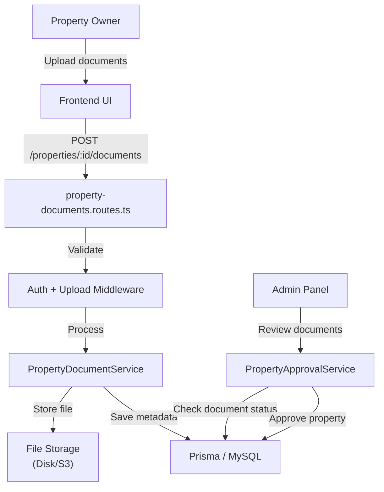
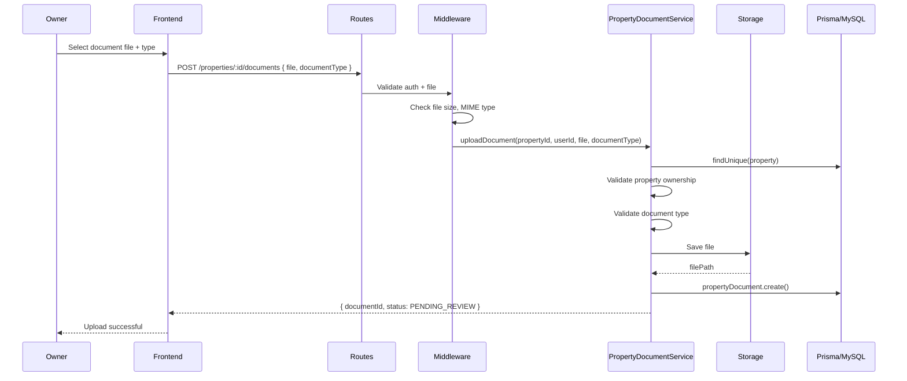
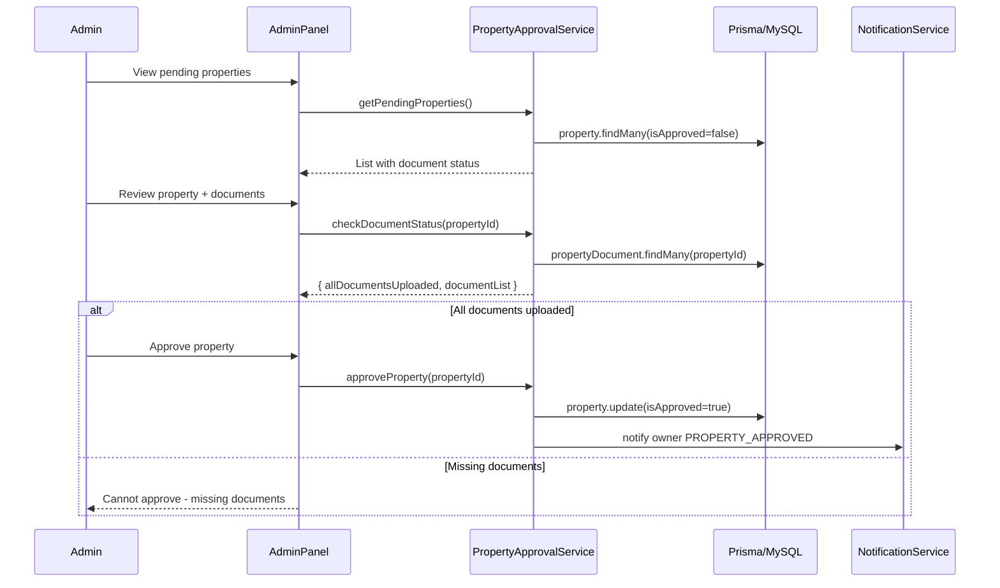
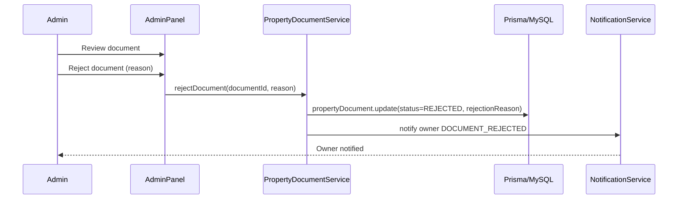

# Design Document: Property Document Uploads

## Overview

This feature enables property owners to upload required legal documents (UPI, land title, land certificate, or certificate of land registration) after creating a property but before admin approval. The system validates document types, stores uploads securely, tracks upload status, and prevents property approval until all required documents are submitted. This ensures compliance with Rwanda's property rental regulations and reduces fraud risk.

## Architecture



## Sequence Diagrams

### Document Upload Flow



### Admin Review & Property Approval



### Document Rejection Flow



## Components and Interfaces

### PropertyDocumentService (new)

**Purpose**: Manage property document uploads, validation, and status tracking.

**Interface**:
```typescript
interface PropertyDocumentService {
  uploadDocument(
    propertyId: number,
    userId: number,
    file: Express.Multer.File,
    documentType: DocumentType
  ): Promise<PropertyDocument>

  getDocumentsByProperty(propertyId: number): Promise<PropertyDocument[]>

  getDocumentById(documentId: number): Promise<PropertyDocument>

  rejectDocument(
    documentId: number,
    rejectionReason: string
  ): Promise<PropertyDocument>

  approveDocument(documentId: number): Promise<PropertyDocument>

  checkAllDocumentsUploaded(propertyId: number): Promise<boolean>

  deleteDocument(documentId: number, userId: number): Promise<void>
}

type DocumentType = 'UPI' | 'LAND_TITLE' | 'LAND_CERTIFICATE' | 'CERTIFICATE_OF_LAND_REGISTRATION'

interface PropertyDocument {
  id: number
  propertyId: number
  documentType: DocumentType
  filePath: string
  fileName: string
  fileSize: number
  mimeType: string
  status: 'PENDING_REVIEW' | 'APPROVED' | 'REJECTED'
  rejectionReason?: string
  uploadedAt: Date
  reviewedAt?: Date
  reviewedBy?: number
}
```

**Responsibilities**:
- Validate file type and size before storage
- Enforce document type constraints (only allowed types)
- Store files securely with unique naming
- Track document status and review history
- Prevent property approval until all documents uploaded
- Notify owner of document rejection
- Support document deletion by owner (PENDING_REVIEW only)

---

### PropertyApprovalService (extended)

**Purpose**: Extend existing approval workflow to check document status.

**Interface additions**:
```typescript
interface PropertyApprovalService {
  // Existing
  approveProperty(propertyId: number): Promise<Property>
  rejectProperty(propertyId: number, reason: string): Promise<Property>

  // New
  canApproveProperty(propertyId: number): Promise<{ canApprove: boolean; reason?: string }>
  getPropertyApprovalStatus(propertyId: number): Promise<ApprovalStatus>
}

interface ApprovalStatus {
  propertyId: number
  isApproved: boolean
  documentsUploaded: boolean
  documentCount: number
  requiredDocumentCount: number
  documents: {
    type: DocumentType
    status: 'PENDING_REVIEW' | 'APPROVED' | 'REJECTED'
  }[]
}
```

**Responsibilities**:
- Check that all required documents are uploaded before approval
- Prevent approval if documents are missing or rejected
- Return clear status information to admin panel

---

### Upload Middleware (extended)

**Purpose**: Extend existing upload middleware for document-specific validation.

**Enhancements**:
```typescript
interface DocumentUploadConfig {
  maxFileSize: number        // bytes (e.g., 10MB)
  allowedMimeTypes: string[] // e.g., ['application/pdf', 'image/jpeg', 'image/png']
  allowedDocumentTypes: DocumentType[]
}

const documentUpload = multer({
  storage: diskStorage({
    destination: (req, file, cb) => {
      const propertyId = req.params.propertyId
      const dir = path.join(env.UPLOAD_DIR, 'property-documents', propertyId.toString())
      fs.mkdirSync(dir, { recursive: true })
      cb(null, dir)
    },
    filename: (req, file, cb) => {
      const documentType = req.body.documentType
      const timestamp = Date.now()
      const ext = path.extname(file.originalname)
      cb(null, `${documentType}-${timestamp}${ext}`)
    }
  }),
  fileFilter: (req, file, cb) => {
    const config = DOCUMENT_UPLOAD_CONFIG
    if (!config.allowedMimeTypes.includes(file.mimetype)) {
      cb(new Error(`File type ${file.mimetype} not allowed`))
    } else {
      cb(null, true)
    }
  },
  limits: {
    fileSize: DOCUMENT_UPLOAD_CONFIG.maxFileSize
  }
})
```

**Responsibilities**:
- Validate file MIME type
- Enforce file size limits
- Organize uploads by property ID
- Generate unique filenames with document type prefix

---

## Data Models

### PropertyDocument (new)

```prisma
model PropertyDocument {
  id              Int       @id @default(autoincrement())
  propertyId      Int       @map("property_id")
  documentType    String    @map("document_type")  // UPI, LAND_TITLE, LAND_CERTIFICATE, CERTIFICATE_OF_LAND_REGISTRATION
  filePath        String    @map("file_path")
  fileName        String    @map("file_name")
  fileSize        Int       @map("file_size")
  mimeType        String    @map("mime_type")
  status          String    @default("PENDING_REVIEW") @map("status")  // PENDING_REVIEW, APPROVED, REJECTED
  rejectionReason String?   @map("rejection_reason") @db.Text
  uploadedAt      DateTime  @default(now()) @map("uploaded_at")
  reviewedAt      DateTime? @map("reviewed_at")
  reviewedBy      Int?      @map("reviewed_by")
  createdAt       DateTime  @default(now()) @map("created_at")
  updatedAt       DateTime  @updatedAt @map("updated_at")

  property        Property  @relation(fields: [propertyId], references: [id], onDelete: Cascade)
  reviewer        User?     @relation(fields: [reviewedBy], references: [id])

  @@index([propertyId])
  @@index([status])
  @@index([documentType])
  @@map("property_documents")
}
```

### Property (additions)

```prisma
model Property {
  // ... existing fields ...
  documents       PropertyDocument[]
}
```

### User (additions)

```prisma
model User {
  // ... existing fields ...
  reviewedDocuments PropertyDocument[] @relation("DocumentReviewer")
}
```

### NotificationType enum (additions)

```prisma
enum NotificationType {
  // ... existing values ...
  DOCUMENT_UPLOADED
  DOCUMENT_APPROVED
  DOCUMENT_REJECTED
  PROPERTY_APPROVED
}
```


## Algorithmic Pseudocode

### 1. Document Upload Validation

```pascal
PROCEDURE uploadDocument(propertyId, userId, file, documentType)
  INPUT: propertyId: Int, userId: Int, file: File, documentType: String
  OUTPUT: PropertyDocument

  // Validate property ownership
  property ← db.property.findUnique(propertyId)
  IF property = null THEN
    THROW Error("Property not found")
  END IF

  IF property.ownerId ≠ userId THEN
    THROW Error("Not authorized to upload documents for this property")
  END IF

  // Validate property is not yet approved
  IF property.isApproved = true THEN
    THROW Error("Cannot upload documents for approved property")
  END IF

  // Validate document type
  allowedTypes ← ['UPI', 'LAND_TITLE', 'LAND_CERTIFICATE', 'CERTIFICATE_OF_LAND_REGISTRATION']
  IF documentType ∉ allowedTypes THEN
    THROW Error("Invalid document type")
  END IF

  // Validate file
  IF file.size > MAX_FILE_SIZE THEN
    THROW Error("File size exceeds maximum allowed")
  END IF

  IF file.mimeType ∉ ALLOWED_MIME_TYPES THEN
    THROW Error("File type not allowed")
  END IF

  // Check for duplicate document type
  existing ← db.propertyDocument.findFirst(
    WHERE propertyId = propertyId AND documentType = documentType AND status ≠ 'REJECTED'
  )
  IF existing ≠ null THEN
    THROW Error("Document of this type already uploaded")
  END IF

  // Store file
  filePath ← storeFile(file, propertyId, documentType)

  // Create database record
  doc ← db.propertyDocument.create({
    propertyId: propertyId,
    documentType: documentType,
    filePath: filePath,
    fileName: file.originalname,
    fileSize: file.size,
    mimeType: file.mimetype,
    status: 'PENDING_REVIEW',
    uploadedAt: now()
  })

  // Notify owner
  notify(userId, 'DOCUMENT_UPLOADED', { documentType, propertyId })

  RETURN doc
END PROCEDURE
```

**Preconditions**:
- `propertyId` references an existing property
- `userId` is the property owner
- `file` is a valid uploaded file object
- `documentType` is one of the allowed types

**Postconditions**:
- `PropertyDocument` record created with `status = 'PENDING_REVIEW'`
- File stored securely on disk/S3
- Owner receives notification
- Property remains `isApproved = false`

---

### 2. Check All Documents Uploaded

```pascal
PROCEDURE checkAllDocumentsUploaded(propertyId)
  INPUT: propertyId: Int
  OUTPUT: allUploaded: Boolean

  requiredTypes ← ['UPI', 'LAND_TITLE', 'LAND_CERTIFICATE', 'CERTIFICATE_OF_LAND_REGISTRATION']
  
  FOR each type IN requiredTypes DO
    doc ← db.propertyDocument.findFirst(
      WHERE propertyId = propertyId 
        AND documentType = type 
        AND status IN ['PENDING_REVIEW', 'APPROVED']
    )
    
    IF doc = null THEN
      RETURN false
    END IF
  END FOR

  RETURN true
END PROCEDURE
```

**Preconditions**:
- `propertyId` references an existing property

**Postconditions**:
- Returns `true` if all 4 required document types have at least one non-rejected upload
- Returns `false` if any required document type is missing

**Loop Invariants**:
- All previously checked document types have at least one valid upload

---

### 3. Approve Property with Document Check

```pascal
PROCEDURE approveProperty(propertyId)
  INPUT: propertyId: Int
  OUTPUT: Property

  property ← db.property.findUnique(propertyId)
  IF property = null THEN
    THROW Error("Property not found")
  END IF

  // Check all documents uploaded
  allUploaded ← checkAllDocumentsUploaded(propertyId)
  IF NOT allUploaded THEN
    THROW Error("Cannot approve property: not all required documents uploaded")
  END IF

  // Check all documents approved (not rejected)
  rejectedDocs ← db.propertyDocument.findMany(
    WHERE propertyId = propertyId AND status = 'REJECTED'
  )
  IF rejectedDocs.length > 0 THEN
    THROW Error("Cannot approve property: some documents have been rejected")
  END IF

  // Approve property
  property ← db.property.update(
    WHERE id = propertyId,
    data: { isApproved: true }
  )

  // Notify owner
  notify(property.ownerId, 'PROPERTY_APPROVED', { propertyId })

  RETURN property
END PROCEDURE
```

**Preconditions**:
- `propertyId` references an existing property
- All required documents are uploaded
- No documents have status `REJECTED`

**Postconditions**:
- `property.isApproved = true`
- Owner receives `PROPERTY_APPROVED` notification
- Property becomes visible to tenants

---

### 4. Reject Document

```pascal
PROCEDURE rejectDocument(documentId, rejectionReason)
  INPUT: documentId: Int, rejectionReason: String
  OUTPUT: PropertyDocument

  doc ← db.propertyDocument.findUnique(documentId)
  IF doc = null THEN
    THROW Error("Document not found")
  END IF

  IF length(rejectionReason) < 10 THEN
    THROW Error("Rejection reason must be at least 10 characters")
  END IF

  // Update document status
  doc ← db.propertyDocument.update(
    WHERE id = documentId,
    data: {
      status: 'REJECTED',
      rejectionReason: rejectionReason,
      reviewedAt: now(),
      reviewedBy: adminUserId
    }
  )

  // Get property owner
  property ← db.property.findUnique(doc.propertyId)
  owner ← db.user.findUnique(property.ownerId)

  // Notify owner
  notify(owner.id, 'DOCUMENT_REJECTED', {
    documentType: doc.documentType,
    reason: rejectionReason,
    propertyId: doc.propertyId
  })

  RETURN doc
END PROCEDURE
```

**Preconditions**:
- `documentId` references an existing document
- `rejectionReason` is non-empty and at least 10 characters

**Postconditions**:
- Document status changed to `REJECTED`
- `rejectionReason` stored
- `reviewedAt` and `reviewedBy` set
- Owner receives notification
- Property cannot be approved until new document uploaded

---

### 5. Delete Document (Owner Only)

```pascal
PROCEDURE deleteDocument(documentId, userId)
  INPUT: documentId: Int, userId: Int
  OUTPUT: void

  doc ← db.propertyDocument.findUnique(documentId)
  IF doc = null THEN
    THROW Error("Document not found")
  END IF

  property ← db.property.findUnique(doc.propertyId)
  IF property.ownerId ≠ userId THEN
    THROW Error("Not authorized to delete this document")
  END IF

  // Only allow deletion if PENDING_REVIEW or REJECTED
  IF doc.status ∉ ['PENDING_REVIEW', 'REJECTED'] THEN
    THROW Error("Cannot delete approved documents")
  END IF

  // Delete file from storage
  deleteFile(doc.filePath)

  // Delete database record
  db.propertyDocument.delete(WHERE id = documentId)
END PROCEDURE
```

**Preconditions**:
- `documentId` references an existing document
- `userId` is the property owner
- Document status is `PENDING_REVIEW` or `REJECTED`

**Postconditions**:
- File deleted from storage
- Database record deleted
- Owner can re-upload new document

---

## Key Functions with Formal Specifications

### PropertyDocumentService.uploadDocument()

```typescript
static async uploadDocument(
  propertyId: number,
  userId: number,
  file: Express.Multer.File,
  documentType: DocumentType
): Promise<PropertyDocument>
```

**Preconditions**:
- `propertyId` references an existing, unapproved property
- `userId` is the authenticated owner of the property
- `file` is a valid uploaded file with size ≤ 10MB
- `file.mimetype` is one of: `application/pdf`, `image/jpeg`, `image/png`
- `documentType` is one of: `UPI`, `LAND_TITLE`, `LAND_CERTIFICATE`, `CERTIFICATE_OF_LAND_REGISTRATION`
- No other document of the same type with status `PENDING_REVIEW` or `APPROVED` exists for this property

**Postconditions**:
- `PropertyDocument` record created with `status = 'PENDING_REVIEW'`
- File stored at `{UPLOAD_DIR}/property-documents/{propertyId}/{documentType}-{timestamp}.{ext}`
- Owner receives `DOCUMENT_UPLOADED` notification
- Returns the created document record

---

### PropertyDocumentService.checkAllDocumentsUploaded()

```typescript
static async checkAllDocumentsUploaded(propertyId: number): Promise<boolean>
```

**Preconditions**:
- `propertyId` references an existing property

**Postconditions**:
- Returns `true` if and only if all 4 required document types have at least one document with status `PENDING_REVIEW` or `APPROVED`
- Returns `false` if any required document type is missing or all documents are `REJECTED`

---

### PropertyApprovalService.canApproveProperty()

```typescript
static async canApproveProperty(propertyId: number): Promise<{ canApprove: boolean; reason?: string }>
```

**Preconditions**:
- `propertyId` references an existing property

**Postconditions**:
- Returns `{ canApprove: true }` if all required documents are uploaded and none are rejected
- Returns `{ canApprove: false, reason: "..." }` if documents are missing or rejected
- Never throws

---

### PropertyDocumentService.rejectDocument()

```typescript
static async rejectDocument(
  documentId: number,
  rejectionReason: string
): Promise<PropertyDocument>
```

**Preconditions**:
- `documentId` references an existing document
- `rejectionReason` is a non-empty string with at least 10 characters

**Postconditions**:
- Document status changed to `REJECTED`
- `rejectionReason`, `reviewedAt`, and `reviewedBy` fields populated
- Owner receives `DOCUMENT_REJECTED` notification
- Property can no longer be approved until new document uploaded

---

### PropertyDocumentService.deleteDocument()

```typescript
static async deleteDocument(documentId: number, userId: number): Promise<void>
```

**Preconditions**:
- `documentId` references an existing document
- `userId` is the property owner
- Document status is `PENDING_REVIEW` or `REJECTED`

**Postconditions**:
- File deleted from storage
- Database record deleted
- Owner can upload a new document of the same type

---

## Example Usage

### Upload a Document

```typescript
// Frontend
const formData = new FormData()
formData.append('file', selectedFile)
formData.append('documentType', 'UPI')

const response = await fetch(`/api/properties/${propertyId}/documents`, {
  method: 'POST',
  body: formData,
  headers: { 'Authorization': `Bearer ${token}` }
})

const document = await response.json()
// { id: 1, propertyId: 5, documentType: 'UPI', status: 'PENDING_REVIEW', uploadedAt: '2024-01-15T10:30:00Z' }
```

### Check Document Status

```typescript
// Admin Panel
const status = await propertyApprovalService.getPropertyApprovalStatus(propertyId)
// {
//   propertyId: 5,
//   isApproved: false,
//   documentsUploaded: true,
//   documentCount: 4,
//   requiredDocumentCount: 4,
//   documents: [
//     { type: 'UPI', status: 'APPROVED' },
//     { type: 'LAND_TITLE', status: 'PENDING_REVIEW' },
//     { type: 'LAND_CERTIFICATE', status: 'APPROVED' },
//     { type: 'CERTIFICATE_OF_LAND_REGISTRATION', status: 'REJECTED' }
//   ]
// }
```

### Approve Property

```typescript
// Admin approves property only after all documents are uploaded
try {
  const approved = await propertyApprovalService.approveProperty(propertyId)
  // Property is now visible to tenants
} catch (error) {
  // "Cannot approve property: not all required documents uploaded"
}
```

---

## Correctness Properties

### Property 1: Invalid document types are always rejected

*For any* document upload request with a `documentType` not in `['UPI', 'LAND_TITLE', 'LAND_CERTIFICATE', 'CERTIFICATE_OF_LAND_REGISTRATION']`, `PropertyDocumentService.uploadDocument()` shall always throw an error and never create a document record.

**Validates: Requirement 1.1**

---

### Property 2: Unauthorized users cannot upload documents

*For any* document upload request where `userId` is not the property owner, `PropertyDocumentService.uploadDocument()` shall always throw an authorization error.

**Validates: Requirement 1.2**

---

### Property 3: Approved properties cannot receive new documents

*For any* property with `isApproved = true`, `PropertyDocumentService.uploadDocument()` shall always throw an error and never create a document record.

**Validates: Requirement 1.3**

---

### Property 4: Duplicate document types are always rejected

*For any* document upload request where a document of the same type with status `PENDING_REVIEW` or `APPROVED` already exists for the property, `PropertyDocumentService.uploadDocument()` shall always throw an error.

**Validates: Requirement 1.4**

---

### Property 5: Oversized files are always rejected

*For any* file upload exceeding `MAX_FILE_SIZE` (10MB), the upload middleware shall always reject the request with a 413 error before reaching the service layer.

**Validates: Requirement 1.5**

---

### Property 6: Invalid MIME types are always rejected

*For any* file with a MIME type not in `['application/pdf', 'image/jpeg', 'image/png']`, the upload middleware shall always reject the request with a 400 error.

**Validates: Requirement 1.6**

---

### Property 7: Successful upload always creates PENDING_REVIEW document

*For any* successful document upload, a `PropertyDocument` record shall be created with `status = 'PENDING_REVIEW'` and `uploadedAt` set to the current timestamp.

**Validates: Requirement 1.7**

---

### Property 8: Successful upload always triggers notification

*For any* successful document upload, a `DOCUMENT_UPLOADED` notification shall be created for the property owner.

**Validates: Requirement 1.8**

---

### Property 9: All required documents must be present for approval

*For any* property, `checkAllDocumentsUploaded()` shall return `true` if and only if all 4 required document types have at least one document with status `PENDING_REVIEW` or `APPROVED`.

**Validates: Requirement 2.1**

---

### Property 10: Rejected documents block property approval

*For any* property with one or more documents having status `REJECTED`, `PropertyApprovalService.approveProperty()` shall always throw an error and never set `isApproved = true`.

**Validates: Requirement 2.2**

---

### Property 11: Missing documents block property approval

*For any* property missing one or more required document types, `PropertyApprovalService.approveProperty()` shall always throw an error with a message indicating which documents are missing.

**Validates: Requirement 2.3**

---

### Property 12: Successful property approval always triggers notification

*For any* successful property approval, a `PROPERTY_APPROVED` notification shall be created for the property owner.

**Validates: Requirement 2.4**

---

### Property 13: Document rejection requires valid reason

*For any* document rejection request with a `rejectionReason` shorter than 10 characters, `PropertyDocumentService.rejectDocument()` shall always throw an error.

**Validates: Requirement 3.1**

---

### Property 14: Document rejection always triggers notification

*For any* successful document rejection, a `DOCUMENT_REJECTED` notification shall be created for the property owner, including the rejection reason.

**Validates: Requirement 3.2**

---

### Property 15: Rejected documents can be re-uploaded

*For any* property with a rejected document, the owner shall be able to upload a new document of the same type without error.

**Validates: Requirement 3.3**

---

### Property 16: Only owners can delete documents

*For any* document deletion request where `userId` is not the property owner, `PropertyDocumentService.deleteDocument()` shall always throw an authorization error.

**Validates: Requirement 4.1**

---

### Property 17: Approved documents cannot be deleted

*For any* document with status `APPROVED`, `PropertyDocumentService.deleteDocument()` shall always throw an error.

**Validates: Requirement 4.2**

---

### Property 18: Deletion removes file from storage

*For any* successful document deletion, the file shall be removed from disk/S3 storage and the database record deleted.

**Validates: Requirement 4.3**

---

## Error Handling

### Scenario 1: Unauthorized Document Upload

**Condition**: User attempting to upload documents for a property they don't own.
**Response**: `403 Forbidden` — `"Not authorized to upload documents for this property"`
**Recovery**: User must log in with the property owner account.

### Scenario 2: File Size Exceeds Limit

**Condition**: Uploaded file is larger than 10MB.
**Response**: `413 Payload Too Large` — `"File size exceeds maximum allowed (10MB)"`
**Recovery**: User must compress or select a smaller file.

### Scenario 3: Invalid File Type

**Condition**: Uploaded file MIME type is not PDF or image.
**Response**: `400 Bad Request` — `"File type not allowed. Allowed types: PDF, JPEG, PNG"`
**Recovery**: User must convert file to supported format.

### Scenario 4: Duplicate Document Type

**Condition**: Owner attempts to upload a second document of the same type.
**Response**: `400 Bad Request` — `"Document of this type already uploaded"`
**Recovery**: User must delete the existing document first or wait for admin review.

### Scenario 5: Property Already Approved

**Condition**: Owner attempts to upload documents for an already-approved property.
**Response**: `400 Bad Request` — `"Cannot upload documents for approved property"`
**Recovery**: N/A — property is already approved.

### Scenario 6: Cannot Approve - Missing Documents

**Condition**: Admin attempts to approve property without all required documents.
**Response**: `400 Bad Request` — `"Cannot approve property: not all required documents uploaded"`
**Recovery**: Admin must wait for owner to upload missing documents.

### Scenario 7: Cannot Approve - Rejected Documents

**Condition**: Admin attempts to approve property with rejected documents.
**Response**: `400 Bad Request` — `"Cannot approve property: some documents have been rejected"`
**Recovery**: Owner must re-upload rejected documents.

### Scenario 8: Invalid Rejection Reason

**Condition**: Admin attempts to reject document with reason < 10 characters.
**Response**: `400 Bad Request` — `"Rejection reason must be at least 10 characters"`
**Recovery**: Admin must provide more detailed rejection reason.

---

## Testing Strategy

### Unit Testing Approach

Test each service method in isolation using mocked Prisma client and mocked file storage.

**Key test cases**:
- `uploadDocument`: valid upload, unauthorized user, oversized file, invalid MIME type, duplicate document type, approved property
- `checkAllDocumentsUploaded`: all documents present, missing document type, all rejected
- `approveProperty`: all documents uploaded, missing documents, rejected documents
- `rejectDocument`: valid rejection, short reason, document not found
- `deleteDocument`: owner deletion, non-owner deletion, approved document deletion

### Property-Based Testing Approach

**Property Test Library**: `fast-check` (JavaScript/TypeScript)

**Key properties to test**:
- For any valid document upload, a PENDING_REVIEW record is created
- For any property with all documents uploaded, `checkAllDocumentsUploaded()` returns true
- For any property with missing documents, approval always fails
- For any rejected document, owner can re-upload

### Integration Testing Approach

Test complete workflows end-to-end:
- Owner creates property → uploads all documents → admin approves
- Owner uploads document → admin rejects → owner re-uploads → admin approves
- Owner uploads document → deletes it → uploads new one
- Admin cannot approve property with missing documents

---

## Performance Considerations

- **File Storage**: Use S3 or similar for scalability; disk storage suitable for MVP
- **Database Indexes**: Index on `propertyId`, `status`, `documentType` for fast queries
- **File Cleanup**: Implement background job to delete rejected documents after 30 days
- **Concurrent Uploads**: Limit to 1 upload per property at a time to prevent race conditions

---

## Security Considerations

- **File Validation**: Validate MIME type and file content (magic bytes) to prevent malicious uploads
- **Access Control**: Enforce ownership checks on all document operations
- **Storage Security**: Store files outside web root; serve via authenticated endpoint only
- **Virus Scanning**: Integrate ClamAV or similar for malware detection on uploaded files
- **Audit Trail**: Log all document operations (upload, review, rejection, deletion) for compliance

---

## Dependencies

- `multer`: File upload middleware
- `express`: Web framework
- `@prisma/client`: Database ORM
- `fast-check`: Property-based testing (for tests)
