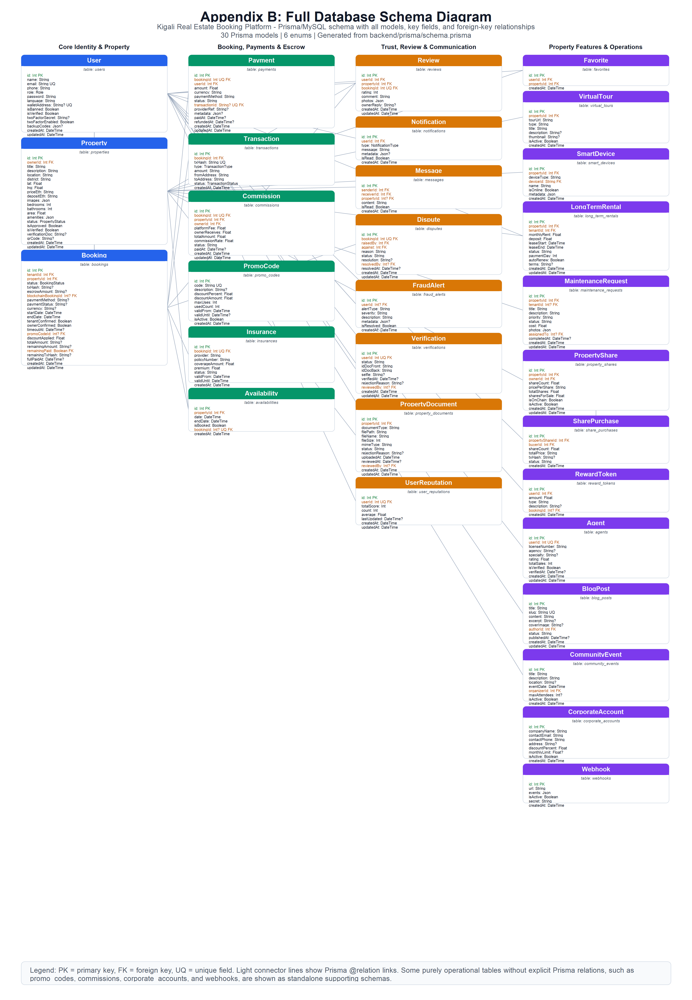
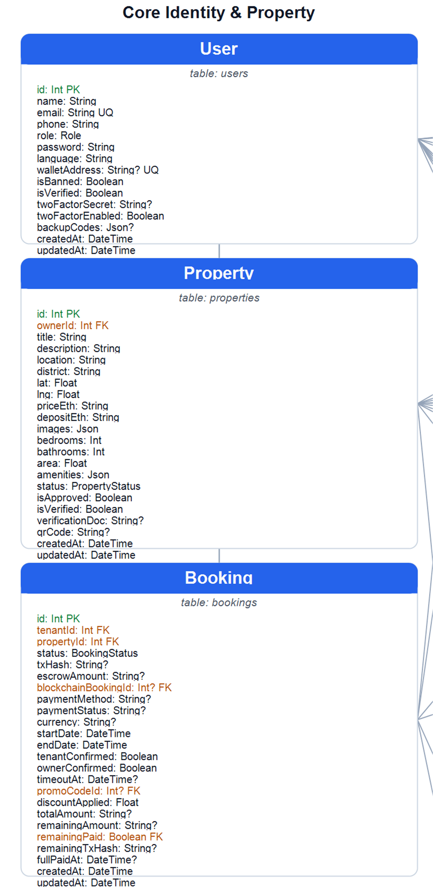
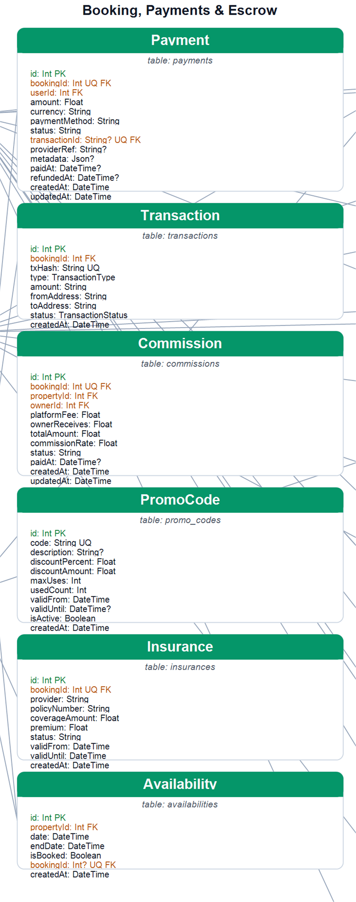
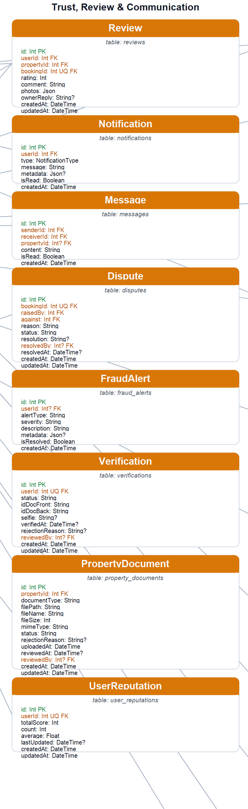
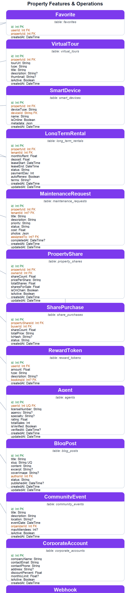

# Complete ERD

Project: Kigali Real Estate Booking Platform  
Database: MySQL  
Source schema: `backend/prisma/schema.prisma`

## ERD Image



If the PNG appears too small in preview, open `COMPLETE_ERD.png` directly and zoom in.

## Readable ERD Sections

These zoomed images are easier to read in normal Markdown preview:









```mermaid
erDiagram
  users {
    Int id PK
    String name
    String email UK
    String phone
    Role role
    String password
    String language
    String walletAddress UK
    Boolean isBanned
    Boolean isVerified
    String twoFactorSecret
    Boolean twoFactorEnabled
    Json backupCodes
    DateTime createdAt
    DateTime updatedAt
  }

  properties {
    Int id PK
    Int ownerId FK
    String title
    Text description
    String location
    String district
    Float lat
    Float lng
    String priceEth
    String depositEth
    Json images
    Int bedrooms
    Int bathrooms
    Float area
    Json amenities
    PropertyStatus status
    Boolean isApproved
    Boolean isVerified
    String verificationDoc
    String qrCode
    DateTime createdAt
    DateTime updatedAt
  }

  bookings {
    Int id PK
    Int tenantId FK
    Int propertyId FK
    BookingStatus status
    String txHash
    String escrowAmount
    Int blockchainBookingId
    String paymentMethod
    String paymentStatus
    String currency
    DateTime startDate
    DateTime endDate
    Boolean tenantConfirmed
    Boolean ownerConfirmed
    DateTime timeoutAt
    Int promoCodeId
    Float discountApplied
    String totalAmount
    String remainingAmount
    Boolean remainingPaid
    String remainingTxHash
    DateTime fullPaidAt
    DateTime createdAt
    DateTime updatedAt
  }

  reviews {
    Int id PK
    Int userId FK
    Int propertyId FK
    Int bookingId FK_UK
    Int rating
    Text comment
    Json photos
    Text ownerReply
    DateTime createdAt
    DateTime updatedAt
  }

  notifications {
    Int id PK
    Int userId FK
    NotificationType type
    String message
    Json metadata
    Boolean isRead
    DateTime createdAt
  }

  transactions {
    Int id PK
    Int bookingId FK
    String txHash UK
    TransactionType type
    String amount
    String fromAddress
    String toAddress
    TransactionStatus status
    DateTime createdAt
  }

  fraud_alerts {
    Int id PK
    Int userId FK
    String alertType
    String severity
    Text description
    Json metadata
    Boolean isResolved
    DateTime createdAt
  }

  verifications {
    Int id PK
    Int userId FK_UK
    String status
    String idDocFront
    String idDocBack
    String selfie
    DateTime verifiedAt
    String rejectionReason
    Int reviewedBy
    DateTime createdAt
    DateTime updatedAt
  }

  favorites {
    Int id PK
    Int userId FK
    Int propertyId FK
    DateTime createdAt
  }

  availabilities {
    Int id PK
    Int propertyId FK
    DateTime date
    DateTime endDate
    Boolean isBooked
    Int bookingId FK_UK
    DateTime createdAt
  }

  payments {
    Int id PK
    Int bookingId FK_UK
    Int userId FK
    Float amount
    String currency
    String paymentMethod
    String status
    String transactionId UK
    String providerRef
    Json metadata
    DateTime paidAt
    DateTime refundedAt
    DateTime createdAt
    DateTime updatedAt
  }

  messages {
    Int id PK
    Int senderId FK
    Int receiverId FK
    Int propertyId FK
    Text content
    Boolean isRead
    DateTime createdAt
  }

  promo_codes {
    Int id PK
    String code UK
    Text description
    Float discountPercent
    Float discountAmount
    Int maxUses
    Int usedCount
    DateTime validFrom
    DateTime validUntil
    Boolean isActive
    DateTime createdAt
  }

  disputes {
    Int id PK
    Int bookingId FK_UK
    Int raisedBy FK
    Int against FK
    Text reason
    String status
    Text resolution
    Int resolvedBy
    DateTime resolvedAt
    DateTime createdAt
    DateTime updatedAt
  }

  blog_posts {
    Int id PK
    String title
    String slug UK
    Text content
    Text excerpt
    String coverImage
    Int authorId FK
    String status
    DateTime publishedAt
    DateTime createdAt
    DateTime updatedAt
  }

  insurances {
    Int id PK
    Int bookingId FK_UK
    String provider
    String policyNumber
    Float coverageAmount
    Float premium
    String status
    DateTime validFrom
    DateTime validUntil
    DateTime createdAt
  }

  reward_tokens {
    Int id PK
    Int userId FK
    Float amount
    String type
    Text description
    Int bookingId
    DateTime createdAt
  }

  agents {
    Int id PK
    Int userId FK_UK
    String licenseNumber
    String agency
    Text specialty
    Float rating
    Int totalSales
    Boolean isVerified
    DateTime verifiedAt
    DateTime createdAt
    DateTime updatedAt
  }

  virtual_tours {
    Int id PK
    Int propertyId FK
    String tourUrl
    String type
    String title
    Text description
    String thumbnail
    Boolean isActive
    DateTime createdAt
  }

  smart_devices {
    Int id PK
    Int propertyId FK
    String deviceType
    String deviceId
    String name
    Boolean isOnline
    Json metadata
    DateTime createdAt
  }

  corporate_accounts {
    Int id PK
    String companyName
    String contactEmail UK
    String contactPhone
    Text address
    Float discountPercent
    Float monthlyLimit
    Boolean isActive
    DateTime createdAt
  }

  community_events {
    Int id PK
    String title
    Text description
    String location
    DateTime eventDate
    Int organizerId FK
    Int maxAttendees
    Boolean isActive
    DateTime createdAt
  }

  webhooks {
    Int id PK
    String url
    Json events
    Boolean isActive
    String secret
    DateTime createdAt
  }

  long_term_rentals {
    Int id PK
    Int propertyId FK
    Int tenantId FK
    Float monthlyRent
    Float deposit
    DateTime leaseStart
    DateTime leaseEnd
    String status
    Int paymentDay
    Boolean autoRenew
    Text terms
    DateTime createdAt
    DateTime updatedAt
  }

  maintenance_requests {
    Int id PK
    Int propertyId FK
    Int tenantId FK
    String title
    Text description
    String priority
    String status
    Float cost
    Json photos
    Int assignedTo FK
    DateTime completedAt
    DateTime createdAt
    DateTime updatedAt
  }

  commissions {
    Int id PK
    Int bookingId UK
    Int propertyId
    Int ownerId
    Float platformFee
    Float ownerReceives
    Float totalAmount
    Float commissionRate
    String status
    DateTime paidAt
    DateTime createdAt
    DateTime updatedAt
  }

  property_documents {
    Int id PK
    Int propertyId FK
    String documentType
    String filePath
    String fileName
    Int fileSize
    String mimeType
    String status
    Text rejectionReason
    DateTime uploadedAt
    DateTime reviewedAt
    Int reviewedBy FK
    DateTime createdAt
    DateTime updatedAt
  }

  property_shares {
    Int id PK
    Int propertyId FK
    Int ownerId FK
    Float shareCount
    String pricePerShare
    Float totalShares
    Float sharesForSale
    Boolean isOnChain
    Boolean isActive
    DateTime createdAt
    DateTime updatedAt
  }

  share_purchases {
    Int id PK
    Int propertyShareId FK
    Int buyerId FK
    Float shareCount
    String totalPrice
    String txHash
    String status
    DateTime createdAt
  }

  user_reputations {
    Int id PK
    Int userId FK_UK
    Int totalScore
    Int count
    Float average
    DateTime lastUpdated
    DateTime createdAt
    DateTime updatedAt
  }

  users ||--o{ properties : owns
  users ||--o{ bookings : makes
  properties ||--o{ bookings : receives
  bookings ||--o{ transactions : has
  users ||--o{ reviews : writes
  properties ||--o{ reviews : receives
  bookings ||--o| reviews : reviewed_by
  users ||--o{ notifications : receives
  users ||--o{ fraud_alerts : triggers
  users ||--o| verifications : has
  users ||--o{ favorites : saves
  properties ||--o{ favorites : saved_as
  properties ||--o{ availabilities : has
  bookings ||--o| availabilities : occupies
  bookings ||--o| payments : paid_by
  users ||--o{ payments : makes
  users ||--o{ messages : sends
  users ||--o{ messages : receives
  properties ||--o{ messages : discussed_in
  bookings ||--o| disputes : disputed_by
  users ||--o{ disputes : raises
  users ||--o{ disputes : receives_against
  users ||--o{ blog_posts : authors
  bookings ||--o| insurances : insured_by
  users ||--o{ reward_tokens : earns
  users ||--o| agents : profile
  properties ||--o{ virtual_tours : has
  properties ||--o{ smart_devices : contains
  users ||--o{ community_events : organizes
  properties ||--o{ long_term_rentals : leased_as
  users ||--o{ long_term_rentals : rents
  properties ||--o{ maintenance_requests : needs
  users ||--o{ maintenance_requests : reports
  users ||--o{ maintenance_requests : assigned
  properties ||--o{ property_documents : verified_with
  users ||--o{ property_documents : reviews
  properties ||--o{ property_shares : fractionalized_as
  users ||--o{ property_shares : owns
  property_shares ||--o{ share_purchases : purchased_in
  users ||--o{ share_purchases : buys
  users ||--o| user_reputations : has
```

## Notes

- `commissions` stores `bookingId`, `propertyId`, and `ownerId`, but the Prisma schema does not define explicit relations for those fields.
- `promo_codes`, `corporate_accounts`, and `webhooks` are standalone administrative/support tables in the current Prisma schema.
- `reward_tokens.bookingId` is stored as an identifier, but no explicit Prisma relation is defined.
